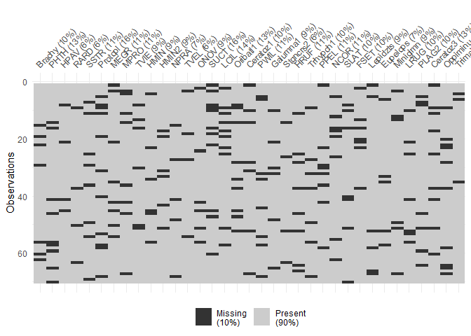
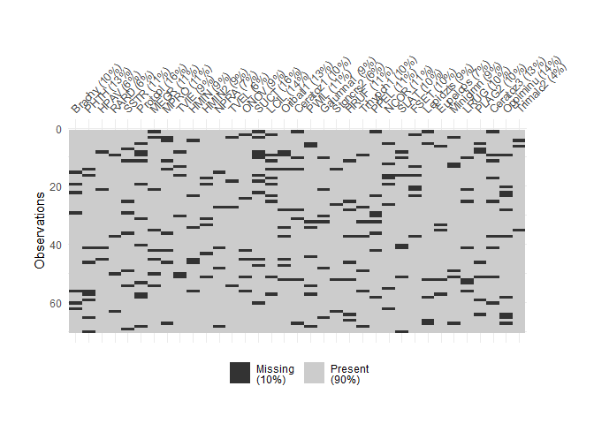
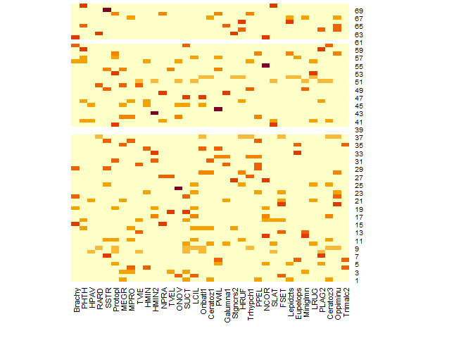
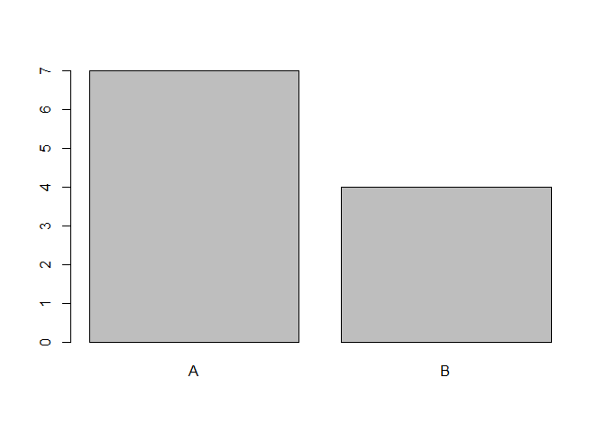

Advanced Data Wrangling
================
N. Schenk
2023-03-15

PLEASE CONTRIBUTE TO MAKE THIS TUTORIAL NICER - make nicer sentences,
add more info where you need it, tell me where it’s hard to understand!

The world of data wrangling is large, and once you learned how to access
certain rows or columns, and how to filter those parts of your data
table you need, the fun just starts.

Topics/ functions :

- assessing the missing data of a table
- summarizing parts of the table (aggregate, apply)
  - R functions : `apply`, `aggregate`
- working with strings : sub, grep, paste
- data wrangling pitfalls and how to avoid them
  - functions : cbind, rbind, merge
- from wide to long and back (reshape2 melt and dcast)

*Note* that unfortunately, this tutorial is not finished yet. If you see
interesting topics to be added, please indicate. If you are working on a
topic and miss some more material about it, please indicate.

## Requirements

**Packages**

``` r
library(vegan) # for the example datasets
library(ggplot2) # for plotting
library(missForest) # adding missing data
library(naniar) # to generate the missing values
library(data.table) # a data wrangling package (similar to tidyverse)

set.seed(0)
```

**Datasets**

``` r
# the mite dataset contains counds of orobatid mites of 70 soil cores (in rows) of 70 mite species.
data(mite)

# the varespec dataset contains estimated cover of 44 plant species measured in 24 plots (rows)
data(varespec)
# The varechem dataset belongs to the varespec dataset. 
# It contains 14 columns of soil characteristics, measured on 24 plots (rows)
# Baresoil gives the estimated cover of bare soil, 
#    Humdepth the thickness of the humus layer.
data(varechem)
#
# combine data from varespec and varechem
varecomb <- data.frame("Pinusyl" = varespec[, c("Pinusylv")], varechem)
varecomb_NA <- prodNA(varecomb, noNA = 0.1)

# introduce missing values in some of the datasets
mite_NA <- prodNA(mite, noNA = 0.1)
mite_NA_small <- prodNA(mite, noNA = 0.001) # remove a small fraction of values
```

**Functions**

``` r
# if you have functions to be loaded, you can add them here.
```

# summarising parts of the table

## apply

``` r
help(apply)
```

`apply()` is a very versatile function, used to apply (execute) a given
R function on each column OR on each row of a data.frame. It is useful
in situation where you would like to execute the same function
repeatedly on each of the columns, and it would be very tedious to write
it by hand :

``` r
# Example
# Aim : calculate the mean of each column of the dataset mite
mean(mite$Brachy)
```

    ## [1] 8.728571

``` r
mean(mite$PHTH)
```

    ## [1] 1.271429

``` r
mean(mite$HPAV)
```

    ## [1] 8.514286

``` r
# ... and so forth, repeating for each of the 35 columns of the mite dataset
```

Maybe you know the functions `rowMeans()` and `colMeans()` which
calculate the mean of every row or every column, respectively.

``` r
colMeans(mite[, 1:3])
```

    ##   Brachy     PHTH     HPAV 
    ## 8.728571 1.271429 8.514286

Apply is a general form of these two functions. It can be used to
calculate the mean of each column, as `colMeans()` does, but it can also
be used to e.g. calculate the standard deviation of each column.

The most important parameters are : `apply(X, MARGIN, FUN)`

- X is a dataset, either a matrix, array, data.frame or a specialised
  form of a data.frame as e.g. a tibble or data.table
- MARGIN is a vector, which gives the “subscripts” where to apply the
  function:
  - 1 stands for rows : `apply(X = mite, MARGIN = 1, sum)` calculates
    the sum of each row in the dataset mite
  - 2 stands for columns. : `apply(X = mite, MARGIN = 2, sum)`
    calculates the sum of each column
  - **EXERCISE** : execute the two example above : (1) calculate the sum
    of each row in the dataset “mite”. And (2) calculate the sum of each
    column in the dataset “mite”.
- FUN : specifies the function which is applied (executed). This can be
  e.g. `sum` to calculate the sum of each row/column, or `mean` to
  calculate the mean.
  - *Speciality* : the function is written without opening and closing
    brackets `()` : instead of `sum()` it is enough to write `sum`.
  - *Advanced* : the FUN argument can also be a longer function with
    arguments, as
    e.g. `apply(X = mite_NA_small, MARGIN = 2, FUN = mean, na.rm = T)`.
    Here, we aim to calculate the mean by avoiding NA values (because
    the mean function does not allow NA values `mean(c(1, 2, NA))`
    returns NA). The form of the function for a single vector would be
    `mean(mite_NA_small$Brachy, na.rm = T)`. Within the apply function,
    we can add the `na.rm = T` argument just after the `MARGIN`
    argument.
  - *Advanced* : it is further possible to apply nested function as
    e.g. `apply(mite_NA_small, MARGIN = 2, FUN = function(x) sum(is.na(x)))`,
    where we aim to calculate the number of missing values in each
    column.

### Exercises “apply”

**Exercise 1** : Calculate the median number of mites in each plot in
the dataset mite.

**Exercise 2** : The varespec dataset contains plant cover data of 24
plots of 44 variables. Calculate the mean and the standard deviation of
the plant cover for each plant species. Additional : store the results
in a new data.frame. Additional 2 : plot the results.

**Exercise 3** : The varespec dataset contains plant cover data of 24
plots of 44 variables. Calculate the estimated cover of each plot, using
the apply function.

Additional : Why is the cover not always 100%?

**Exercise 4** : During data analysis of the varespec data, it turned
out that the cover data of some of the plant species need to be log
transformed. Please log-transform the following columns : Cladunci
Cladcocc Cladcorn Cladgrac Cladfimb Cladcris Cladchlo Cladbotr.

*Hint* : During execution, you will run into a problem. Please try to
solve as you would do in a real analysis.

### Additional and Outlook

Note about loops:

``` r
# It could also be tempting to write a loop in a situation where the apply function :
for(i in 1:ncol(mite)){
  return(mean(mite[, i]))
}
# which can return the same as the apply function.
```

apply internally calls a loop in the R language, so in this situation
there is no (or only a marginal) time gain when writing the loop
yourself. Note that the functions `rowMeans()` and `colMeans()` run
loops in C rather than R code, and are therefore faster than an ordinary
loop and faster than the apply function. If you are interested in those
type of considerations, you might consider [this
post](http://rstudio-pubs-static.s3.amazonaws.com/5526_83e42f97a07141e88b75f642dbae8b1b.html).

# aggregate

Similar to apply. Check out [this
tutorial](https://www.r-bloggers.com/2018/07/how-to-aggregate-data-in-r/)

``` r
# generate a dataset for practice purpose : 
experimental_data_long <- data.table(plotname = paste0("plot", 1:50),
           treatment = as.factor(c(rep("A", 10), c(rep("B", 10)), c(rep("C", 10)), c(rep("D", 10)), c(rep("E", 10)))),
           subtreatment = as.factor(rep(rep(c("dry", "wet"), 5), 5)),
           plantheight = c(rnorm(10, mean = 5, sd = 1), 
                           rnorm(10, mean = 9, sd = 1),
                           rnorm(10, mean = 4, sd = 1),
                           rnorm(10, mean = 3.5, sd = 1),
                           rnorm(10, mean = 8, sd = 1)))

# create example dataset 2
experimental_data_long_dup <- rbindlist(list(experimental_data_long, experimental_data_long[1, ]))
```

## Exercises “aggregate”

**Exercise 1** : Use the dataset “experimental_data_long”. Calculate the
mean plant height per experimental treatment.

**Exercise 2** : Use the dataset “experimental_data_long”. Calculate the
mean plant height per experimental treatment, excluding the treatment
“C”.

**Exercise 3** : “Duplicated rows” : use the dataset
“experimental_data_long_dup”, and calculate the mean height per
treatment as in Exercise 1.

**Exercise 3** : Calculate the mean plant height of each combination of
treatment and subtreatment (e.g. the mean plant height in treatment “A”,
“wet”, the mean in treatment “A”, “dry”, …)

# missing data

## getting an overview

with package `naniar` or by hand

``` r
# with package naniar
vis_miss(mite_NA)
```

    ## Warning: `gather_()` was deprecated in tidyr 1.2.0.
    ## ℹ Please use `gather()` instead.
    ## ℹ The deprecated feature was likely used in the visdat package.
    ##   Please report the issue at <]8;;https://github.com/ropensci/visdat/issueshttps://github.com/ropensci/visdat/issues]8;;>.

<!-- -->

``` r
# note : if you can't read the outer right labels, you can use : 
vis_miss(mite_NA) + theme(plot.margin = 
                            margin(t = 1,  # Top margin
                            r = 2,    # Right margin
                            b = 1,  # Bottom margin
                            l = 1,  # Left margin
                            unit = "cm"))
```

<!-- -->

``` r
# by hand
is.na(mite_NA$Brachy) # show which elements are missing
```

    ##  [1] FALSE FALSE FALSE FALSE FALSE FALSE FALSE FALSE FALSE FALSE FALSE FALSE
    ## [13] FALSE FALSE  TRUE FALSE FALSE FALSE  TRUE FALSE FALSE  TRUE FALSE FALSE
    ## [25] FALSE FALSE FALSE FALSE  TRUE FALSE FALSE FALSE FALSE FALSE FALSE FALSE
    ## [37] FALSE FALSE FALSE FALSE FALSE FALSE FALSE FALSE FALSE FALSE FALSE FALSE
    ## [49] FALSE FALSE FALSE FALSE FALSE FALSE FALSE  TRUE FALSE FALSE FALSE  TRUE
    ## [61] FALSE  TRUE FALSE FALSE FALSE FALSE FALSE FALSE FALSE FALSE

``` r
sum(is.na(mite_NA$Brachy)) # count the missing elements in 1 column
```

    ## [1] 7

``` r
apply(mite_NA, 2, function(x) sum(is.na(x))) # count the missing elements in all columns
```

    ##   Brachy     PHTH     HPAV     RARD     SSTR  Protopl     MEGR     MPRO 
    ##        7        9        4        4        8       11        8        8 
    ##     TVIE     HMIN    HMIN2     NPRA     TVEL     ONOV     SUCT     LCIL 
    ##        6        6        6        5        4        6       11       10 
    ## Oribatl1 Ceratoz1     PWIL Galumna1 Stgncrs2     HRUF Trhypch1     PPEL 
    ##        9        7        8        6        4        8        7        8 
    ##     NCOR     SLAT     FSET Lepidzts Eupelops Miniglmn     LRUG    PLAG2 
    ##        8        7        7        6        5        6        7        7 
    ## Ceratoz3 Oppiminu Trimalc2 
    ##        9       10        3

``` r
# basic visualisation similar to naniar package
heatmap(is.na(mite_NA)*1, Colv = NA, Rowv = NA)
```

<!-- -->

### Exercises “missing data”

**Exercise 1** : Use the missForest::prodNA() function to remove 20% of
the data (i.e. to add 20% of NA) from the varespec dataset which is
provided by the vegan package.

**Exercise 2** : Count the number of missing values for the following
columns in the varespec dataset : “Dicrfusc” “Dicrpoly” “Hylosple”
“Pleuschr” “Polypili” “Polyjuni” “Polycomm” “Pohlnuta” “Ptilcili”
“Barbhatc” “Cladarbu” “Cladrang”

**Exercise 3** : Please generate a heatmap of the missing values in the
varespec dataset with missing values which you created in Exercise 1.
Use (1) the naniar package and (2) the base R package function heatmap()
to do so.

**Exercise 4** : Imagine the data in the above generated varespec
dataset with missing values was wrongly labelled. The values labelled as
NA were in fact not missing, but zero. Please recode all missing values
with 0.

## Fitting models on incomplete data

A problem of missing data is, that most models used in statistical
analysis rely on complete data (i.e. no missing values). However, in
ecological datasets, missing data is very common. It is sometimes not
obvious for the user, that very common models (like linear models
`lm()`) automatically exclude all rows from the dataset where at least
one value is missing.

``` r
mod1 <- lm(Pinusyl ~ N + Baresoil + Humdepth + pH, data = varecomb_NA)
summary(mod1)
```

    ## 
    ## Call:
    ## lm(formula = Pinusyl ~ N + Baresoil + Humdepth + pH, data = varecomb_NA)
    ## 
    ## Residuals:
    ##      Min       1Q   Median       3Q      Max 
    ## -0.42124 -0.08613  0.03211  0.07019  0.64472 
    ## 
    ## Coefficients:
    ##              Estimate Std. Error t value Pr(>|t|)
    ## (Intercept)  0.139453   3.007761   0.046    0.965
    ## N           -0.042421   0.033030  -1.284    0.246
    ## Baresoil    -0.004892   0.008499  -0.576    0.586
    ## Humdepth     0.088241   0.286141   0.308    0.768
    ## pH           0.329389   0.800026   0.412    0.695
    ## 
    ## Residual standard error: 0.356 on 6 degrees of freedom
    ##   (13 observations deleted due to missingness)
    ## Multiple R-squared:  0.4582, Adjusted R-squared:  0.09702 
    ## F-statistic: 1.269 on 4 and 6 DF,  p-value: 0.3776

``` r
mod1$df.residual + length(coef(mod1))# the model was fitted on 15 degrees of freedom
```

    ## [1] 11

``` r
# but remember, we had 24 plots : 
nrow(varecomb_NA)
```

    ## [1] 24

``` r
# where did the rows go?
nrow(na.omit(varecomb_NA[, c("Pinusyl", "N", "Baresoil", "Humdepth", "pH")]))
```

    ## [1] 11

Note that lm does not exclude all rows with missing values :
`nrow(na.omit(varecomb_NA))` only leaves 5 rows.

This can be a serious problem when doing model selection, or comparing
models with different sets of explanatory variables. When removing a
given variable, we add, at the same time, the rows which were missing in
the given variable back to the model.

``` r
# mod 1 from above
mod1 <- lm(Pinusyl ~ N + Baresoil + Humdepth + pH, data = varecomb_NA)
mod1$df.residual + length(coef(mod1))
```

    ## [1] 11

``` r
# removing a variable from the model
mod2 <- lm(Pinusyl ~ Baresoil + Humdepth + pH, data = varecomb_NA)
summary(mod2)
```

    ## 
    ## Call:
    ## lm(formula = Pinusyl ~ Baresoil + Humdepth + pH, data = varecomb_NA)
    ## 
    ## Residuals:
    ##      Min       1Q   Median       3Q      Max 
    ## -0.24373 -0.17711 -0.05134  0.05556  0.93514 
    ## 
    ## Coefficients:
    ##              Estimate Std. Error t value Pr(>|t|)
    ## (Intercept) -1.461116   2.744495  -0.532    0.607
    ## Baresoil    -0.002890   0.007991  -0.362    0.726
    ## Humdepth    -0.007001   0.267176  -0.026    0.980
    ## pH           0.611636   0.760182   0.805    0.442
    ## 
    ## Residual standard error: 0.3497 on 9 degrees of freedom
    ##   (11 observations deleted due to missingness)
    ## Multiple R-squared:  0.2628, Adjusted R-squared:  0.01706 
    ## F-statistic: 1.069 on 3 and 9 DF,  p-value: 0.4095

``` r
mod2$df.residual + length(coef(mod2))
```

    ## [1] 13

``` r
# model 2 works with 3 more rows!
```

In a case like the above, model1 and model2 are no longer directly
comparable.

Therefore, it is better to specify the set of plots BEFORE fitting
models. If there are too many missing values, the missing values can be
imputed. (If you are interested in this topic, we could make a session
about missing value imputation)

## Incomplete data can be unbalanced data

``` r
experimental_data <- data.table(plotname = paste0("plot", 1:20),
           treatment = as.factor(c(rep("A", 10), c(rep("B", 10)))),
           plantheight = c(rnorm(10, mean = 5, sd = 1), rnorm(10, mean = 9, sd = 1)))
# well-designed experiment : 
plot(experimental_data$treatment) # treatments are balanced
```

<!-- -->

``` r
# imagine some of the rows were lost while collecting the data.
experimental_dataNA <- rbindlist(list(prodNA(experimental_data[treatment == "A", ], noNA = 0.1),
                                 prodNA(experimental_data[treatment == "B", ], noNA = 0.3)))

# Check what happens to experimental design when some of the rows are lost.
plot(na.omit(experimental_dataNA)$treatment) # treatments are NOT balanced any more!
```

<!-- -->

``` r
table(na.omit(experimental_dataNA)$treatment)
```

    ## 
    ## A B 
    ## 7 3

In this example, it is easy to spot that the experimental design is
unbalanced. But in larger, more complex datasets, it can be harder.

**Additional exercise** : Check your own dataset: Do you have NA values?
If yes, how many and where? Is the design still balanced? If you have a
complete dataset, try to add missing values with `prodNA` and check. If
you don’t have a your dataset at hand, use one of the example datasets,
e.g. by combining the datasets `varespec` and `varechem`

# working with strings

It can be very handy to know about these four functions : `paste()`,
`paste0()`, `grep()`, `sub()`

``` r
# paste : pasting strings together
# simple usage : 
paste("A", "B") # note the default separator is " "
```

    ## [1] "A B"

``` r
paste("A", "B", sep = ", ")
```

    ## [1] "A, B"

``` r
paste("A", "B", sep = "SEPARATOR")
```

    ## [1] "ASEPARATORB"

``` r
# paste0 has no separator by default
paste0("A", "B")
```

    ## [1] "AB"

``` r
# usage example : file paths
PATH_TO_DATA <- "C:/USER/Documents/RESEARCH_PROJECTS/PROJECT1/DATA/" # 
paste0(PATH_TO_DATA, "dataset1.Rds")
```

    ## [1] "C:/USER/Documents/RESEARCH_PROJECTS/PROJECT1/DATA/dataset1.Rds"

``` r
# the above can be used e.g. within a reading function like load()

# grep : finding patterns in strings
grep("A", c("A", "B", "C")) # returns the index of the matched element
```

    ## [1] 1

``` r
grep("A", c("A", "B", "C"), value = T) # returns the value of the matched element
```

    ## [1] "A"

``` r
# usage example : filtering columns of a dataset
grep("Clad", names(varespec)) # find all "Clad" species
```

    ##  [1] 22 23 24 25 26 27 28 29 30 31 32 33 34 42 43 44

``` r
grep("Clad", names(varespec), value = T)
```

    ##  [1] "Cladarbu" "Cladrang" "Cladstel" "Cladunci" "Cladcocc" "Cladcorn"
    ##  [7] "Cladgrac" "Cladfimb" "Cladcris" "Cladchlo" "Cladbotr" "Cladamau"
    ## [13] "Cladsp"   "Cladcerv" "Claddefo" "Cladphyl"

``` r
varespec[, grep("Clad", names(varespec))] # filtering all columns which contain "Clad" in species names
```

    ##    Cladarbu Cladrang Cladstel Cladunci Cladcocc Cladcorn Cladgrac Cladfimb
    ## 18    21.73    21.47     3.50     0.30     0.18     0.23     0.25     0.25
    ## 15    12.05     8.13     0.18     2.65     0.13     0.18     0.23     0.25
    ## 24     3.58     5.52     0.07     8.93     0.00     0.20     0.48     0.00
    ## 27     1.42     7.63     2.55     0.15     0.00     0.38     0.12     0.10
    ## 23     9.08     9.22     0.05     0.73     0.08     1.42     0.50     0.17
    ## 19     7.23     4.95    22.08     0.25     0.10     0.25     0.18     0.10
    ## 22     6.10     3.60     0.23     2.38     0.17     0.13     0.18     0.20
    ## 16     7.13    14.03     0.02     0.82     0.15     0.05     0.22     0.22
    ## 28     0.17     0.87     0.00     0.05     0.02     0.03     0.07     0.10
    ## 13    23.07    23.67    11.90     0.95     0.17     0.05     0.23     0.18
    ## 14    17.45     1.32     0.12    23.68     0.22     0.50     0.15     0.23
    ## 20     6.80    11.22     0.05     4.75     0.03     0.12     0.22     0.18
    ## 25     6.00     2.25     0.00     0.80     0.12     0.57     0.17     0.15
    ## 7     35.00    42.50     0.28     0.35     0.08     0.20     0.25     0.18
    ## 5     18.50    59.00     0.98     0.28     0.23     0.23     0.23     0.10
    ## 6     39.00    37.50    11.30     3.45     0.18     0.20     0.25     0.25
    ## 3      8.80    29.50    55.60     0.25     0.08     0.25     0.25     0.15
    ## 4     15.73    20.03    28.20     0.73     0.10     0.15     0.13     0.10
    ## 2      0.48    24.50    75.00     0.20     0.00     0.03     0.03     0.05
    ## 9      0.46     4.00    84.30     0.25     0.25     0.25     0.25     0.25
    ## 12     3.60    14.60    63.30     1.30     0.00     0.25     0.25     0.25
    ## 10     1.30     8.70    84.30     0.25     0.25     0.25     0.00     0.25
    ## 11     9.67    29.80    31.80     2.53     0.25     0.25     0.25     0.00
    ## 21     0.70     4.70    10.90     0.25     0.00     0.05     0.25     0.25
    ##    Cladcris Cladchlo Cladbotr Cladamau Cladsp Cladcerv Claddefo Cladphyl
    ## 18     0.23     0.00     0.00     0.08   0.02     0.00     0.25     0.00
    ## 15     1.23     0.00     0.00     0.00   0.00     0.00     1.00     0.00
    ## 24     0.07     0.10     0.02     0.00   0.00     0.00     0.33     0.00
    ## 27     0.03     0.00     0.02     0.00   0.02     0.00     0.15     0.00
    ## 23     1.78     0.05     0.05     0.00   0.00     0.00     1.97     0.00
    ## 19     0.12     0.05     0.02     0.00   0.00     0.00     0.37     0.00
    ## 22     0.20     0.02     0.00     0.00   0.02     0.00     0.15     0.00
    ## 16     0.17     0.00     0.00     0.00   0.02     0.00     0.67     0.00
    ## 28     0.02     0.00     0.02     0.00   0.00     0.00     0.08     0.00
    ## 13     0.57     0.02     0.07     0.00   0.07     0.00     0.47     0.00
    ## 14     0.97     0.00     0.00     0.00   0.00     0.00     1.57     0.05
    ## 20     0.07     0.00     0.02     0.00   0.02     0.00     1.20     0.00
    ## 25     0.07     0.00     0.00     0.00   0.02     0.02     0.05     0.00
    ## 7      0.13     0.08     0.00     0.00   0.00     0.00     0.10     0.00
    ## 5      0.05     0.00     0.00     0.03   0.00     0.00     0.25     0.00
    ## 6      0.23     0.03     0.00     0.00   0.03     0.00     0.28     0.00
    ## 3      0.10     0.03     0.00     0.03   0.00     0.00     0.08     0.00
    ## 4      0.15     0.00     0.00     0.00   0.05     0.05     0.08     0.00
    ## 2      0.03     0.03     0.00     0.00   0.00     0.03     0.03     0.00
    ## 9      0.25     0.25     0.00     0.00   0.25     0.00     0.25     0.25
    ## 12     0.25     0.00     0.00     0.00   0.00     0.00     0.25     0.00
    ## 10     0.25     0.25     0.00     0.00   0.00     0.00     0.25     0.25
    ## 11     0.25     0.00     0.00     0.00   0.00     0.00     0.00     0.25
    ## 21     0.25     0.25     0.25     0.00   0.00     0.00     0.40     0.00

``` r
# sub : substitute parts of words
sub(" ", "_", "hello world") # substitute the space " " character with an underline "_"
```

    ## [1] "hello_world"

``` r
sub(" ", "_", "plantago_lanceolata")
```

    ## [1] "plantago_lanceolata"

``` r
# you can apply sub on a vector
sub(" ", "_", c("plantago lanceolata", "taraxacum officinale", "vicia sepia"))
```

    ## [1] "plantago_lanceolata"  "taraxacum_officinale" "vicia_sepia"

``` r
# that means, you can also apply it to a column, or to the  names of a dataset.
```

## Outlook : regular expressions

- [Good tutorial](https://stringr.tidyverse.org/) about using the
  `stringr` package.
- Tutorial on regular expressions at : [Biodiversity Exploratories
  Synthesis
  Tutorials](https://github.com/biodiversity-exploratories-synthesis/Synthesis_courses_workshops/blob/main/Help_desk_Spring_2021/2021_synthesis_Rhelpdesk_regex_and_text_processing.R)

# From wide to long and back

See nice reshape2 tutorial at :
<https://cran.r-project.org/web/packages/data.table/vignettes/datatable-reshape.html>

**Exercise “from long to wide and back”** : Use the example datasets
varechem and varespec. Change the format such that all plant species are
collapsed to one column called “plantspecies”. The cover data is found
in a column called “plantcover”, and the chemical compounds remain in
their columns. What are the advantages and disadvantages of a this data
format? Is it more useful, or less useful than before?

# Data wrangling pitfalls and how to avoid them

- not relying on specialised packages –\> expert solutions out there,
  search them
- cbind/rbind without matching column/row names
- duplicated rows (e.g. can’t aggregate)
- excluding rows with NAs
- distinguish NAs from 0s
- checking by hand vs. checking by plotting –\> either see only a few
  data points or whole column
- NEVER update a table by several scripts -\> you will lose the info
  when you did the last change!
  - rename output after each step (e.g. “step1”, “step2”, …)
- NEVER do changes by hand in excel, or if yes, report them VERY
  detailed in script
- not specifying which package is used data.table::melt() or
  reshape2::melt()

Please share your own experiences - what do you perceive as “dangerous”
functions, or which errors have you experienced?
