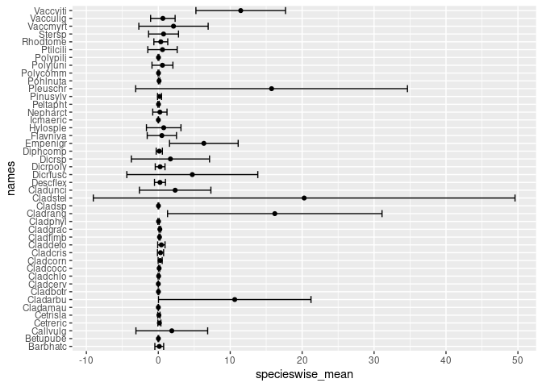

Advanced Data Wrangling - Solutions
================
N. Schenk
2023-03-15

This Script contains the solutions to the tutorial about advanced data
wrangling.

### Requirements

## Requirements

**Packages**

``` r
library(vegan) # for the example datasets
library(ggplot2) # for plotting
library(missForest) # adding missing data
library(naniar) # to generate the missing values
library(data.table) # a data wrangling package (similar to tidyverse)
set.seed(0)
```

**Datasets** (Please consider the tutorial itself for explanations about
the datasets)

``` r
data(mite)
data(varespec)
data(varechem)
varecomb <- data.frame("Pinusyl" = varespec[, c("Pinusylv")], varechem)
varecomb_NA <- prodNA(varecomb, noNA = 0.1)
mite_NA <- prodNA(mite, noNA = 0.1)
mite_NA_small <- prodNA(mite, noNA = 0.001)
# generate a dataset for practice purpose : 
experimental_data_long <- data.table(plotname = paste0("plot", 1:50),
           treatment = as.factor(c(rep("A", 10), c(rep("B", 10)), c(rep("C", 10)), c(rep("D", 10)), c(rep("E", 10)))),
           subtreatment = as.factor(rep(rep(c("dry", "wet"), 5), 5)),
           plantheight = c(rnorm(10, mean = 5, sd = 1), 
                           rnorm(10, mean = 9, sd = 1),
                           rnorm(10, mean = 4, sd = 1),
                           rnorm(10, mean = 3.5, sd = 1),
                           rnorm(10, mean = 8, sd = 1)))

# create example dataset 2
experimental_data_long_dup <- rbindlist(list(experimental_data_long, experimental_data_long[1, ]))
```

### Exercises “apply”

**Exercise 1** : Calculate the median number of mites in each plot in
the dataset mite.

``` r
# the mite dataset contains counds of orobatid mites of 70 soil cores (in rows) of 70 mite species.
# solution with rowMeans()
rowMeans(mite)
```

    ##          1          2          3          4          5          6          7 
    ##  4.0000000  7.6571429  5.3142857  8.1714286  5.6857143  5.9714286  4.6285714 
    ##          8          9         10         11         12         13         14 
    ##  3.6000000  3.5142857  4.7428571  6.1714286  6.0857143  5.0571429  7.6857143 
    ##         15         16         17         18         19         20         21 
    ##  2.8571429  2.7714286  2.5714286  3.3714286  3.3714286  5.2571429  3.3428571 
    ##         22         23         24         25         26         27         28 
    ##  4.9142857  2.3142857  2.2857143  3.5142857  3.4285714  4.9428571  3.1714286 
    ##         29         30         31         32         33         34         35 
    ##  3.1714286  2.7428571  3.7142857  2.6571429  3.8857143  5.5428571  3.1714286 
    ##         36         37         38         39         40         41         42 
    ##  3.8000000  3.9714286  5.4000000  2.6857143  4.4857143  2.3142857  4.0000000 
    ##         43         44         45         46         47         48         49 
    ##  4.2285714  1.7142857  4.5142857  4.4000000  3.4571429  3.2285714  3.0571429 
    ##         50         51         52         53         54         55         56 
    ##  4.2285714  2.6000000  3.2000000  4.1428571  1.4000000  1.6571429  3.0857143 
    ##         57         58         59         60         61         62         63 
    ##  0.2285714  3.4571429  2.5714286  3.6285714  1.2000000  0.3714286  2.4571429 
    ##         64         65         66         67         68         69         70 
    ##  2.5142857  3.2000000  3.3142857 22.3142857  3.1714286  5.2571429  3.4571429

``` r
# solution with apply()
apply(mite, 1, mean)
```

    ##          1          2          3          4          5          6          7 
    ##  4.0000000  7.6571429  5.3142857  8.1714286  5.6857143  5.9714286  4.6285714 
    ##          8          9         10         11         12         13         14 
    ##  3.6000000  3.5142857  4.7428571  6.1714286  6.0857143  5.0571429  7.6857143 
    ##         15         16         17         18         19         20         21 
    ##  2.8571429  2.7714286  2.5714286  3.3714286  3.3714286  5.2571429  3.3428571 
    ##         22         23         24         25         26         27         28 
    ##  4.9142857  2.3142857  2.2857143  3.5142857  3.4285714  4.9428571  3.1714286 
    ##         29         30         31         32         33         34         35 
    ##  3.1714286  2.7428571  3.7142857  2.6571429  3.8857143  5.5428571  3.1714286 
    ##         36         37         38         39         40         41         42 
    ##  3.8000000  3.9714286  5.4000000  2.6857143  4.4857143  2.3142857  4.0000000 
    ##         43         44         45         46         47         48         49 
    ##  4.2285714  1.7142857  4.5142857  4.4000000  3.4571429  3.2285714  3.0571429 
    ##         50         51         52         53         54         55         56 
    ##  4.2285714  2.6000000  3.2000000  4.1428571  1.4000000  1.6571429  3.0857143 
    ##         57         58         59         60         61         62         63 
    ##  0.2285714  3.4571429  2.5714286  3.6285714  1.2000000  0.3714286  2.4571429 
    ##         64         65         66         67         68         69         70 
    ##  2.5142857  3.2000000  3.3142857 22.3142857  3.1714286  5.2571429  3.4571429

**Exercise 2** : The varespec dataset contains plant cover data of 24
plots of 44 variables. Calculate the mean and the standard deviation of
the plant cover for each plant species. Additional : store the results
in a new data.frame. Additional 2 : plot the results.

``` r
apply(varespec, 2, mean)
```

    ##     Callvulg     Empenigr     Rhodtome     Vaccmyrt     Vaccviti     Pinusylv 
    ##  1.877916667  6.332916667  0.349583333  2.112916667 11.459583333  0.171250000 
    ##     Descflex     Betupube     Vacculig     Diphcomp       Dicrsp     Dicrfusc 
    ##  0.233333333  0.012083333  0.634166667  0.135000000  1.687500000  4.730000000 
    ##     Dicrpoly     Hylosple     Pleuschr     Polypili     Polyjuni     Polycomm 
    ##  0.252500000  0.751666667 15.748750000  0.025416667  0.577083333  0.029583333 
    ##     Pohlnuta     Ptilcili     Barbhatc     Cladarbu     Cladrang     Cladstel 
    ##  0.109166667  0.583750000  0.132916667 10.627083333 16.196250000 20.279583333 
    ##     Cladunci     Cladcocc     Cladcorn     Cladgrac     Cladfimb     Cladcris 
    ##  2.345000000  0.116250000  0.259166667  0.214166667  0.165000000  0.311250000 
    ##     Cladchlo     Cladbotr     Cladamau       Cladsp     Cetreric     Cetrisla 
    ##  0.048333333  0.019583333  0.005833333  0.021666667  0.150000000  0.084583333 
    ##     Flavniva     Nepharct       Stersp     Peltapht     Icmaeric     Cladcerv 
    ##  0.493750000  0.219166667  0.730000000  0.031666667  0.009166667  0.004166667 
    ##     Claddefo     Cladphyl 
    ##  0.426250000  0.033333333

``` r
apply(varespec, 2, sd)
```

    ##    Callvulg    Empenigr    Rhodtome    Vaccmyrt    Vaccviti    Pinusylv 
    ##  4.98777896  4.77271546  0.96579086  4.81850823  6.23043475  0.27404082 
    ##    Descflex    Betupube    Vacculig    Diphcomp      Dicrsp    Dicrfusc 
    ##  0.76377590  0.05098842  1.70369398  0.42977244  5.43446990  9.10489405 
    ##    Dicrpoly    Hylosple    Pleuschr    Polypili    Polyjuni    Polycomm 
    ##  0.67829870  2.40066778 18.89316930  0.06143071  1.45502571  0.06855522 
    ##    Pohlnuta    Ptilcili    Barbhatc    Cladarbu    Cladrang    Cladstel 
    ##  0.10154959  2.04087537  0.61106094 10.60304898 14.91032989 29.31683868 
    ##    Cladunci    Cladcocc    Cladcorn    Cladgrac    Cladfimb    Cladcris 
    ##  4.96817086  0.08879936  0.28130004  0.11197502  0.08048764  0.42694376 
    ##    Cladchlo    Cladbotr    Cladamau      Cladsp    Cetreric    Cetrisla 
    ##  0.08244454  0.05221021  0.01791688  0.05189175  0.20909744  0.15505901 
    ##    Flavniva    Nepharct      Stersp    Peltapht    Icmaeric    Cladcerv 
    ##  2.03701361  0.99186656  2.07957563  0.08286535  0.02483277  0.01212854 
    ##    Claddefo    Cladphyl 
    ##  0.50944823  0.08427010

``` r
# adding output to a data.frame
specieswise_varespec <- data.frame(names = names(varespec),
           specieswise_mean = apply(varespec, 2, mean),
           specieswise_sd = apply(varespec, 2, sd))
# note the rownames are a bit irritating, they can be removed
rownames(specieswise_varespec) <- NULL

# plotting
ggplot(specieswise_varespec, aes(x = names, y = specieswise_mean)) +
  geom_point() +
  geom_errorbar(aes(ymin = specieswise_mean - specieswise_sd, 
                    ymax = specieswise_mean + specieswise_sd)) +
  coord_flip()
```

<!-- -->

``` r
#TODO : this plot still misses a nice title and nicer axis labels, and maybe some extras like colors? Would you feel to add this and send to us, so the tutorial gets nicer?
```

**Exercise 3** : The varespec dataset contains plant cover data of 24
plots of 44 variables. Calculate the estimated cover of each plot, using
the apply function.

Additional : Why is the cover not always 100%?

``` r
apply(varespec, 1, sum)
```

    ##     18     15     24     27     23     19     22     16     28     13     14 
    ##  89.20  89.82  94.21 125.61  90.46  81.27 109.76  88.52 110.70 101.89  81.65 
    ##     20     25      7      5      6      3      4      2      9     12     10 
    ##  64.11  94.06 103.38  94.77 110.90 106.67  84.83 119.13 122.60 119.80 122.37 
    ##     11     21 
    ## 112.84  99.17

**Exercise 4** : During data analysis of the varespec data, it turned
out that the cover data of some of the plant species need to be log
transformed. Please log-transform the following columns : Cladunci
Cladcocc Cladcorn Cladgrac Cladfimb Cladcris Cladchlo Cladbotr.

*Hint* : During execution, you will run into a problem. Please try to
solve as you would do in a real analysis.

``` r
varespec_columns_to_log_transform <- c("Cladunc", "Cladcocc", "Cladcorn", "Cladgrac", "Cladfimb", "Cladcris", "Cladchlo", "Cladbotr")

apply(varespec[, which(names(varespec) %in% varespec_columns_to_log_transform)],
      2, log)
```

    ##     Cladcocc   Cladcorn   Cladgrac  Cladfimb    Cladcris  Cladchlo  Cladbotr
    ## 18 -1.714798 -1.4696760 -1.3862944 -1.386294 -1.46967597      -Inf      -Inf
    ## 15 -2.040221 -1.7147984 -1.4696760 -1.386294  0.20701417      -Inf      -Inf
    ## 24      -Inf -1.6094379 -0.7339692      -Inf -2.65926004 -2.302585 -3.912023
    ## 27      -Inf -0.9675840 -2.1202635 -2.302585 -3.50655790      -Inf -3.912023
    ## 23 -2.525729  0.3506569 -0.6931472 -1.771957  0.57661336 -2.995732 -2.995732
    ## 19 -2.302585 -1.3862944 -1.7147984 -2.302585 -2.12026354 -2.995732 -3.912023
    ## 22 -1.771957 -2.0402208 -1.7147984 -1.609438 -1.60943791 -3.912023      -Inf
    ## 16 -1.897120 -2.9957323 -1.5141277 -1.514128 -1.77195684      -Inf      -Inf
    ## 28 -3.912023 -3.5065579 -2.6592600 -2.302585 -3.91202301      -Inf -3.912023
    ## 13 -1.771957 -2.9957323 -1.4696760 -1.714798 -0.56211892 -3.912023 -2.659260
    ## 14 -1.514128 -0.6931472 -1.8971200 -1.469676 -0.03045921      -Inf      -Inf
    ## 20 -3.506558 -2.1202635 -1.5141277 -1.714798 -2.65926004      -Inf -3.912023
    ## 25 -2.120264 -0.5621189 -1.7719568 -1.897120 -2.65926004      -Inf      -Inf
    ## 7  -2.525729 -1.6094379 -1.3862944 -1.714798 -2.04022083 -2.525729      -Inf
    ## 5  -1.469676 -1.4696760 -1.4696760 -2.302585 -2.99573227      -Inf      -Inf
    ## 6  -1.714798 -1.6094379 -1.3862944 -1.386294 -1.46967597 -3.506558      -Inf
    ## 3  -2.525729 -1.3862944 -1.3862944 -1.897120 -2.30258509 -3.506558      -Inf
    ## 4  -2.302585 -1.8971200 -2.0402208 -2.302585 -1.89711998      -Inf      -Inf
    ## 2       -Inf -3.5065579 -3.5065579 -2.995732 -3.50655790 -3.506558      -Inf
    ## 9  -1.386294 -1.3862944 -1.3862944 -1.386294 -1.38629436 -1.386294      -Inf
    ## 12      -Inf -1.3862944 -1.3862944 -1.386294 -1.38629436      -Inf      -Inf
    ## 10 -1.386294 -1.3862944       -Inf -1.386294 -1.38629436 -1.386294      -Inf
    ## 11 -1.386294 -1.3862944 -1.3862944      -Inf -1.38629436      -Inf      -Inf
    ## 21      -Inf -2.9957323 -1.3862944 -1.386294 -1.38629436 -1.386294 -1.386294

``` r
# please note that the log of 0 is not defined. Therefore, we need to take log(x + 1)

apply(varespec[, which(names(varespec) %in% varespec_columns_to_log_transform)],
      2, function(x) log(x + 1))
```

    ##      Cladcocc   Cladcorn   Cladgrac   Cladfimb   Cladcris   Cladchlo   Cladbotr
    ## 18 0.16551444 0.20701417 0.22314355 0.22314355 0.20701417 0.00000000 0.00000000
    ## 15 0.12221763 0.16551444 0.20701417 0.22314355 0.80200159 0.00000000 0.00000000
    ## 24 0.00000000 0.18232156 0.39204209 0.00000000 0.06765865 0.09531018 0.01980263
    ## 27 0.00000000 0.32208350 0.11332869 0.09531018 0.02955880 0.00000000 0.01980263
    ## 23 0.07696104 0.88376754 0.40546511 0.15700375 1.02245093 0.04879016 0.04879016
    ## 19 0.09531018 0.22314355 0.16551444 0.09531018 0.11332869 0.04879016 0.01980263
    ## 22 0.15700375 0.12221763 0.16551444 0.18232156 0.18232156 0.01980263 0.00000000
    ## 16 0.13976194 0.04879016 0.19885086 0.19885086 0.15700375 0.00000000 0.00000000
    ## 28 0.01980263 0.02955880 0.06765865 0.09531018 0.01980263 0.00000000 0.01980263
    ## 13 0.15700375 0.04879016 0.20701417 0.16551444 0.45107562 0.01980263 0.06765865
    ## 14 0.19885086 0.40546511 0.13976194 0.20701417 0.67803354 0.00000000 0.00000000
    ## 20 0.02955880 0.11332869 0.19885086 0.16551444 0.06765865 0.00000000 0.01980263
    ## 25 0.11332869 0.45107562 0.15700375 0.13976194 0.06765865 0.00000000 0.00000000
    ## 7  0.07696104 0.18232156 0.22314355 0.16551444 0.12221763 0.07696104 0.00000000
    ## 5  0.20701417 0.20701417 0.20701417 0.09531018 0.04879016 0.00000000 0.00000000
    ## 6  0.16551444 0.18232156 0.22314355 0.22314355 0.20701417 0.02955880 0.00000000
    ## 3  0.07696104 0.22314355 0.22314355 0.13976194 0.09531018 0.02955880 0.00000000
    ## 4  0.09531018 0.13976194 0.12221763 0.09531018 0.13976194 0.00000000 0.00000000
    ## 2  0.00000000 0.02955880 0.02955880 0.04879016 0.02955880 0.02955880 0.00000000
    ## 9  0.22314355 0.22314355 0.22314355 0.22314355 0.22314355 0.22314355 0.00000000
    ## 12 0.00000000 0.22314355 0.22314355 0.22314355 0.22314355 0.00000000 0.00000000
    ## 10 0.22314355 0.22314355 0.00000000 0.22314355 0.22314355 0.22314355 0.00000000
    ## 11 0.22314355 0.22314355 0.22314355 0.00000000 0.22314355 0.00000000 0.00000000
    ## 21 0.00000000 0.04879016 0.22314355 0.22314355 0.22314355 0.22314355 0.22314355

## Exercises “aggregate”

**Exercise 1** : Use the dataset “experimental_data_long”. Calculate the
mean plant height per experimental treatment.

``` r
aggregate(plantheight ~ treatment, FUN = mean, data = experimental_data_long)
```

    ##   treatment plantheight
    ## 1         A    4.944275
    ## 2         B    9.109573
    ## 3         C    4.104028
    ## 4         D    3.495528
    ## 5         E    7.893834

**Exercise 2** : Use the dataset “experimental_data_long”. Calculate the
mean plant height per experimental treatment, excluding the treatment
“C”.

``` r
aggregate(plantheight ~ treatment, FUN = mean, data = experimental_data_long[!which(experimental_data_long$treatment == "C")])
```

    ##   treatment plantheight
    ## 1         A    4.944275
    ## 2         B    9.109573
    ## 3         D    3.495528
    ## 4         E    7.893834

**Exercise 3** : “Duplicated rows” : use the dataset
“experimental_data_long_dup”, and calculate the mean height per
treatment as in Exercise 1.

``` r
aggregate(plantheight ~ treatment, FUN = mean, data = experimental_data_long_dup)
```

    ##   treatment plantheight
    ## 1         A    5.055065
    ## 2         B    9.109573
    ## 3         C    4.104028
    ## 4         D    3.495528
    ## 5         E    7.893834

``` r
# aggregate does not check for duplicated rows - here it includes the duplicated row just as the others and includes it to the mean.
```

**Exercise 3** : Calculate the mean plant height of each combination of
treatment and subtreatment (e.g. the mean plant height in treatment “A”,
“wet”, the mean in treatment “A”, “dry”, …)

``` r
aggregate(plantheight ~ treatment + subtreatment, FUN = mean, data = experimental_data_long)
```

    ##    treatment subtreatment plantheight
    ## 1          A          dry    5.103724
    ## 2          B          dry    8.866772
    ## 3          C          dry    3.971124
    ## 4          D          dry    3.154606
    ## 5          E          dry    7.807791
    ## 6          A          wet    4.784826
    ## 7          B          wet    9.352375
    ## 8          C          wet    4.236932
    ## 9          D          wet    3.836450
    ## 10         E          wet    7.979877

### Exercises “missing data”

**Exercise 1** : Use the missForest::prodNA() function to remove 20% of
the data (i.e. to add 20% of NA) from the varespec dataset which is
provided by the vegan package.

``` r
varespec_NA <- prodNA(varespec, noNA = 0.2)
```

**Exercise 2** : Count the number of missing values for the following
columns in the varespec dataset : “Dicrfusc” “Dicrpoly” “Hylosple”
“Pleuschr” “Polypili” “Polyjuni” “Polycomm” “Pohlnuta” “Ptilcili”
“Barbhatc” “Cladarbu” “Cladrang”

``` r
#TODO add solution
# there is no solution yet - would you like to provide one?
# selecting the columns specified above
varespec[, c("Dicrfusc", "Dicrpoly", "Hylosple", "Pleuschr", "Polypili", "Polyjuni", "Polycomm", "Pohlnuta", "Ptilcili", "Barbhatc", "Cladarbu", "Cladrang")]
```

    ##    Dicrfusc Dicrpoly Hylosple Pleuschr Polypili Polyjuni Polycomm Pohlnuta
    ## 18     1.62     0.00     0.00     4.67     0.02     0.13     0.00     0.13
    ## 15    10.92     0.02     0.00    37.75     0.02     0.23     0.00     0.03
    ## 24     0.00     1.68     0.00    32.92     0.00     0.23     0.00     0.32
    ## 27     3.63     0.00     6.70    58.07     0.00     0.00     0.13     0.02
    ## 23     3.42     0.02     0.00    19.42     0.02     2.12     0.00     0.17
    ## 19     0.32     0.02     0.00    21.03     0.02     1.58     0.18     0.07
    ## 22    37.07     0.00     0.00    26.38     0.00     0.00     0.00     0.10
    ## 16    25.80     0.23     0.00    18.98     0.00     0.02     0.00     0.13
    ## 28     0.52     0.20     9.97    70.03     0.00     0.08     0.00     0.07
    ## 13     2.50     0.00     0.00     5.52     0.00     0.02     0.00     0.03
    ## 14    11.32     0.00     0.00     7.75     0.00     0.30     0.02     0.07
    ## 20     1.87     0.08     1.35    13.73     0.07     0.05     0.00     0.12
    ## 25    10.82     0.00     0.02    28.77     0.00     6.98     0.13     0.00
    ## 7      0.45     0.03     0.00     0.10     0.00     0.25     0.00     0.03
    ## 5      0.25     0.03     0.00     0.03     0.18     0.65     0.00     0.00
    ## 6      0.85     0.00     0.00     0.05     0.03     0.08     0.00     0.00
    ## 3      0.55     0.00     0.00     0.05     0.00     0.00     0.00     0.03
    ## 4      0.20     0.00     0.00     1.53     0.00     0.10     0.00     0.05
    ## 2      0.03     0.00     0.00     0.75     0.00     0.03     0.00     0.00
    ## 9      0.38     0.25     0.00     4.07     0.00     0.25     0.00     0.25
    ## 12     0.25     0.00     0.00     6.00     0.00     0.00     0.00     0.25
    ## 10     0.25     0.25     0.00     0.67     0.00     0.25     0.00     0.25
    ## 11     0.25     0.25     0.00    17.70     0.25     0.25     0.00     0.25
    ## 21     0.25     3.00     0.00     2.00     0.00     0.25     0.25     0.25
    ##    Ptilcili Barbhatc Cladarbu Cladrang
    ## 18     0.12     0.00    21.73    21.47
    ## 15     0.02     0.00    12.05     8.13
    ## 24     0.03     0.00     3.58     5.52
    ## 27     0.08     0.08     1.42     7.63
    ## 23     1.80     0.02     9.08     9.22
    ## 19     0.27     0.02     7.23     4.95
    ## 22     0.03     0.00     6.10     3.60
    ## 16     0.10     0.00     7.13    14.03
    ## 28     0.03     0.00     0.17     0.87
    ## 13     0.25     0.07    23.07    23.67
    ## 14     0.00     0.00    17.45     1.32
    ## 20     0.00     0.00     6.80    11.22
    ## 25     0.22     0.00     6.00     2.25
    ## 7      0.00     0.00    35.00    42.50
    ## 5      0.00     0.00    18.50    59.00
    ## 6      0.08     0.00    39.00    37.50
    ## 3      0.03     0.00     8.80    29.50
    ## 4      0.00     0.00    15.73    20.03
    ## 2      0.03     0.00     0.48    24.50
    ## 9      0.25     0.00     0.46     4.00
    ## 12     0.00     0.00     3.60    14.60
    ## 10     0.00     0.00     1.30     8.70
    ## 11     0.67     0.00     9.67    29.80
    ## 21    10.00     3.00     0.70     4.70

``` r
# running the apply function on the subset :
apply(varespec[, c("Dicrfusc", "Dicrpoly", "Hylosple", "Pleuschr", "Polypili", "Polyjuni", "Polycomm", "Pohlnuta", "Ptilcili", "Barbhatc", "Cladarbu", "Cladrang")], 
      2, FUN = function(x) sum(is.na(x)))
```

    ## Dicrfusc Dicrpoly Hylosple Pleuschr Polypili Polyjuni Polycomm Pohlnuta 
    ##        0        0        0        0        0        0        0        0 
    ## Ptilcili Barbhatc Cladarbu Cladrang 
    ##        0        0        0        0

``` r
pdf("test.pdf")
plot(varechem$N, varechem$pH)
dev.off()
```

    ## png 
    ##   2

``` r
getwd()
```

    ## [1] "/home/novalid/Documents/github/R-buddies-course/2023_Spring/tutorials"

**Exercise 3** : Please generate a heatmap of the missing values in the
varespec dataset with missing values which you created in Exercise 1.
Use (1) the naniar package and (2) the base R package function heatmap()
to do so.

``` r
#TODO add solution
# there is no solution yet - would you like to provide one?
```

**Exercise 4** : Imagine the data in the above generated varespec
dataset with missing values was wrongly labelled. The values labelled as
NA were in fact not missing, but zero. Please recode all missing values
with 0.

``` r
varespec_NA[is.na(varespec_NA)] <- 0
```
